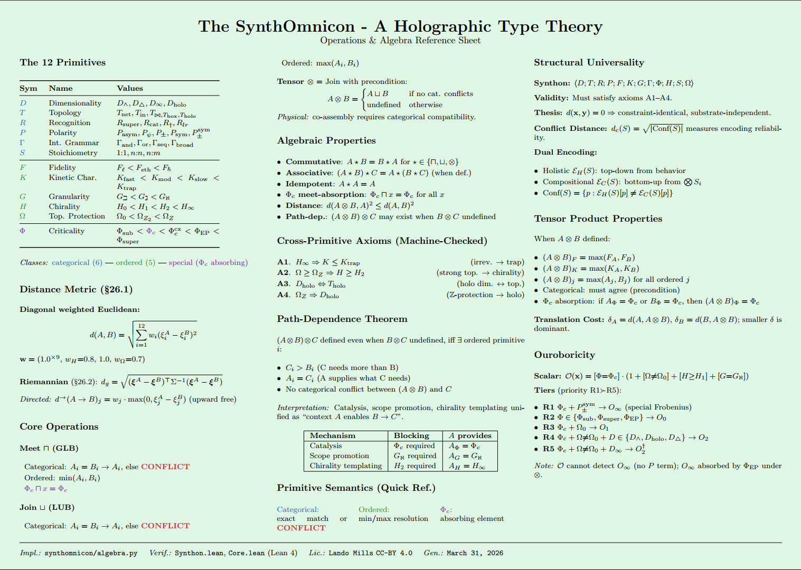

# SynthOmnicon

**A Holographic Type Theory**

---

## Primitive Space

The grammar encodes any system as a 12-tuple 

**⟨D;T;R;P;F;K;G;Γ;Φ;H;S;Ω⟩**

Spanning dimensionality, topology, recognition, polarity, fidelity, kinetics, granularity, logical structure, criticality, chirality, stoichiometry, and symmetry breaking.

318 catalog entries spanning physics, biology, mathematics, and cosmology are projected into primitive space via Classical MDS over Hamming distance.

### SynthOmnicon Reference Sheet



---

## The Three-Projection Framework

The grammar (π₁) is one of three irreducible projections of a fundamental information substrate I:

| Projection | Mode | Encodes |
|---|---|---|
| π₁ (structural) | Grammar | Topological invariants — *what kind* |
| π₂ (energetic) | Continuous | Real-valued exchange — *how much* |
| π₃ (ouroboricity) | Closure | Scaling invariants — *how it closes on itself* |

Inter-projection constraint maps Cᵢⱼ define what values in projection j are compatible with a given value in projection i. Every Millennium Prize Problem is a constraint map problem:

| Problem | Constraint Map Statement |
|---|---|
| Riemann Hypothesis (RH) | C₁₃($\Phi_c^ℂ, P_\text{neutral}$) = { $Re(s) = {1/2}$ } |
| Yang–Mills | C₁₂( $K_\text{trap}, G_\aleph, \Phi_c$ ) ⊆ ( $\Delta_\text{min}, \infty$ ) |
| Navier–Stokes | C₁₂( $\Phi_\text{sub}, D_\text{cube}, K_\text{mod}$ ) ⊆ { $E(t) < \infty$ } |

**Lee–Yang (1952)** is the unique proved instance of C₁₃ and serves as the template for all constraint-map proof strategies.

| Proven Instance | Statement |
|---|---|
| **P-150** | Lee–Yang zero locus derived as C₁₃($\Phi_c^ℂ, P_\pm^{\text{sym}}$) — the only known proved non-trivial constraint map instance ✅ |

---

## Installation

```bash
git clone https://github.com/umpolungfish/synthomnicon.git
cd synthomnicon
pip install -e .
```

Copy `.env.example` to `.env` and set your API key:

```bash
cp .env.example .env
# edit .env: ANTHROPIC_API_KEY=...
```

Launch the interactive menu:

```bash
syncon menu
```

Or run the agent loop directly:

```bash
python syncon_inquiry.py
```

---

## Citation

If you use SynthOmnicon in your research, please cite:

```
Mills, L. (https://orcid.org/0000-0003-0003-0552).
```

---

## Repository Structure

| File | Description |
|---|---|
| `syncon_catalog.json` | 318 encoded systems |
| `syncon_inquiry.py` | Interactive query interface |
| `syncon_primitive_map.py` | Visualization (MDS + network) |
| `space_search/primitives.py` | Ordinal maps for all 12 primitives |
| `PRIMITIVE_PREDICTIONS.md` | 155 predictions (P-1 — P-155) |
| `SYNTHONICON_DIAPHORICS.md` | Domain encoding compendium |
| `SYNTHONICON_ONTICS.md` | Ontological foundations |
| `PRIMITIVE_THEOREMS.md` | Formal theorems §1–§23 |

---

## Key Results

| ID | Statement |
|---|---|
| **P-150** | Lee–Yang zero locus derived as C₁₃($\Phi_c^ℂ, P_\pm^{\text{sym}}$) — the only known proved non-trivial constraint map instance ✅ |
| **P-149** | Ouroboricity $O ≥ 3$ is necessary for modeling completeness of $O₂$ systems (structural Gödel) |
| **P-70** | Inflaton ≡ Higgs ≡ axion — three-scale K_slow identity |
| **Theorem 001–005** | Consciousness encoding; stellar phenomenology; cosmological arc as experience |
| **RH–Lee-Yang correspondence** | (machine-checked in Lean): shared $\Phi_c^ℂ$ encoding; structural distance 5; P mismatch identified as the key gap |

*See `PRIMITIVE_PREDICTIONS.md` for the full prediction archive.*

---

## Summary Table: Framework Overview

| Component | Description |
|---|---|
| **Primitive Space** | 12-tuple grammar encoding any system |
| **Three Projections** | π₁ (structural/grammar), π₂ (energetic/continuous), π₃ (ouroboric/closure) |
| **Constraint Maps** | Cᵢⱼ — compatibility between projections |
| **Millennium Problems** | 3/7 encoded as constraint map statements |
| **Proved Instance** | Lee–Yang (1952) as C₁₃ template |
| **Catalog Size** | 318 entries across physics, biology, mathematics, cosmology |
| **Predictions** | 155 (P-1 through P-155) |
| **Theorems** | §1–§23 formalized |